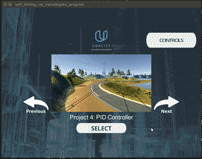
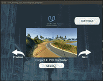
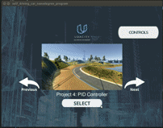

# CarND-Controls-PID
Self-Driving Car Engineer Nanodegree Program

---

## Dependencies

* cmake >= 3.5
 * All OSes: [click here for installation instructions](https://cmake.org/install/)
* make >= 4.1(mac, linux), 3.81(Windows)
  * Linux: make is installed by default on most Linux distros
  * Mac: [install Xcode command line tools to get make](https://developer.apple.com/xcode/features/)
  * Windows: [Click here for installation instructions](http://gnuwin32.sourceforge.net/packages/make.htm)
* gcc/g++ >= 5.4
  * Linux: gcc / g++ is installed by default on most Linux distros
  * Mac: same deal as make - [install Xcode command line tools]((https://developer.apple.com/xcode/features/)
  * Windows: recommend using [MinGW](http://www.mingw.org/)
* [uWebSockets](https://github.com/uWebSockets/uWebSockets)
  * Run either `./install-mac.sh` or `./install-ubuntu.sh`.
  * If you install from source, checkout to commit `e94b6e1`, i.e.
    ```
    git clone https://github.com/uWebSockets/uWebSockets 
    cd uWebSockets
    git checkout e94b6e1
    ```
    Some function signatures have changed in v0.14.x. See [this PR](https://github.com/udacity/CarND-MPC-Project/pull/3) for more details.
* Simulator. You can download these from the [project intro page](https://github.com/udacity/self-driving-car-sim/releases) in the classroom.

Fellow students have put together a guide to Windows set-up for the project [here](https://s3-us-west-1.amazonaws.com/udacity-selfdrivingcar/files/Kidnapped_Vehicle_Windows_Setup.pdf) if the environment you have set up for the Sensor Fusion projects does not work for this project. There's also an experimental patch for windows in this [PR](https://github.com/udacity/CarND-PID-Control-Project/pull/3).

## Basic Build Instructions

1. Clone this repo.
2. Make a build directory: `mkdir build && cd build`
3. Compile: `cmake .. && make`
4. Run it: `./pid`. 

Tips for setting up your environment can be found [here](https://classroom.udacity.com/nanodegrees/nd013/parts/40f38239-66b6-46ec-ae68-03afd8a601c8/modules/0949fca6-b379-42af-a919-ee50aa304e6a/lessons/f758c44c-5e40-4e01-93b5-1a82aa4e044f/concepts/23d376c7-0195-4276-bdf0-e02f1f3c665d)

## Editor Settings

We've purposefully kept editor configuration files out of this repo in order to
keep it as simple and environment agnostic as possible. However, we recommend
using the following settings:

* indent using spaces
* set tab width to 2 spaces (keeps the matrices in source code aligned)

## Code Style

Please (do your best to) stick to [Google's C++ style guide](https://google.github.io/styleguide/cppguide.html).

## Project Instructions and Rubric

Note: regardless of the changes you make, your project must be buildable using
cmake and make!

More information is only accessible by people who are already enrolled in Term 2
of CarND. If you are enrolled, see [the project page](https://classroom.udacity.com/nanodegrees/nd013/parts/40f38239-66b6-46ec-ae68-03afd8a601c8/modules/f1820894-8322-4bb3-81aa-b26b3c6dcbaf/lessons/e8235395-22dd-4b87-88e0-d108c5e5bbf4/concepts/6a4d8d42-6a04-4aa6-b284-1697c0fd6562)
for instructions and the project rubric.

## Hints!

* You don't have to follow this directory structure, but if you do, your work
  will span all of the .cpp files here. Keep an eye out for TODOs.

## Reflection
#### 1. Describe the effect each of the P, I, D components had in your implementation.

* **P component**

|kp=0.01;ki=0.0;kd=0.1|kp=0.2;ki=0.0;kd=0.1|
|---|---|
|| |

***The effect of P component is to reduce the error between the response and the reference value.*** 
In the above two gifs, the controller with smaller P value kp = 0.01 cannot have large enough steering angle to guide the vehicle back to the center line; the controller with larger P value kp = 0.2 can pull the vehicle back to the center, however have large oscillations.

* **D component**

|kp=0.2;ki=0.0;kd=0.1|kp=0.2;ki=0.0;kd=2.0|
|---|---|
|| |

***The effect of D component is to reduce oscillations.*** 
In the above two gifs, the controller with larger D value kd = 2.0 has much smaller oscillations compared with kd = 0.1.

* **I component**

**Cross track error controller**

|kp=0.2;ki=0.0;kd=2.0|kp=0.2;ki=0.01;kd=2.0|
|---|---|
|| |

***The effect of I value is to eliminate systematic bias.***
 As the systematic bias for the cte pid controller is small, adding I component to the controller doesn't have significant influence on the controller's performance, except for the starting stage where the controller with ki = 0.01 has larger oscillation than ki = 0.0.

**Speed controller**

|kp=0.2;ki=0.0;kd=5.0|kp=0.2;ki=0.002;kd=5.0|
|---|---|
|| |

However, the I component is quite effective in the speed pid controller. As the friction applied on the vehicle is a systematic bias that is not negligible, the speed controller with ki = 0.0 cannot reach the reference speed = 30.0 (left gif). Then by setting ki = 0.002, the right gif shows the controller can eliminate the systematic bias and successfully reach the reference speed.

#### 2. Describe how the final hyperparameters were chosen.

I chose to tune the parameters manually. I refered to this [post](https://robotics.stackexchange.com/questions/167/what-are-good-strategies-for-tuning-pid-loops) and the strategy I took is the following:
* Step 1: Increase the P gain until the response is steady oscillation.
* Step 2: Increase the D gain until the oscillations are reduced to the acceptable level.
* Step 3: Repeat steps 2 and 3 until increasing the D gain does not stop the oscillations.
* Step 4: Increase the I gain to eliminate the systematic bias.

Finally, the parameters I chose are:
* cte controller: kp = 0.2, ki = 0.001, kd = 2.0
* speed controller: kp = 0.2, ki = 0.002, kd = 5.0
